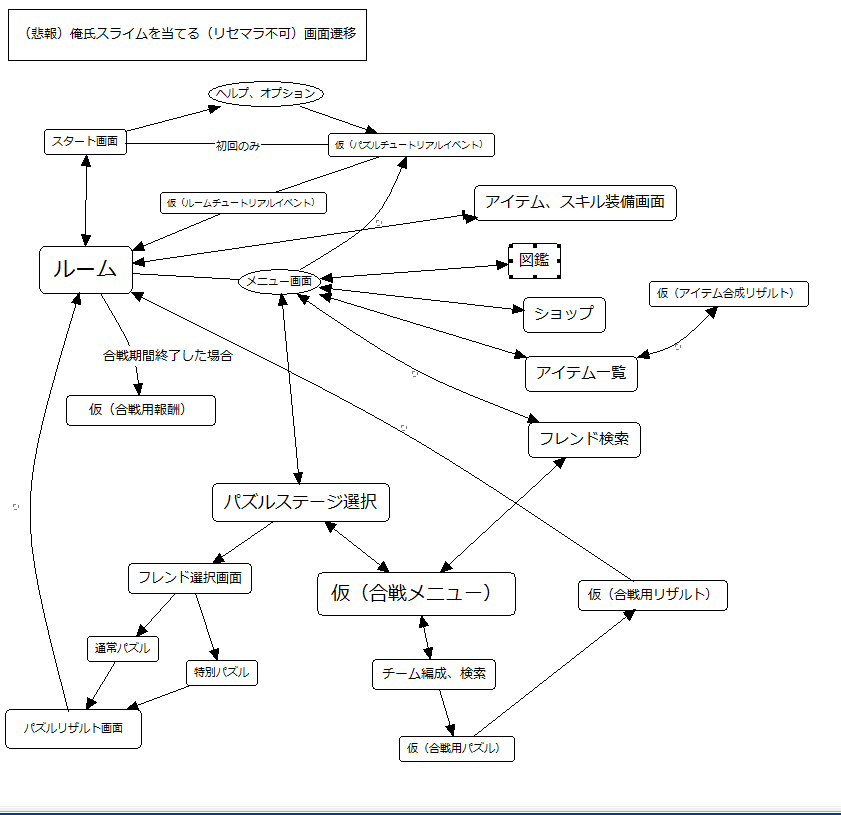

 この 作品 は <a rel="license" href="http://creativecommons.org/licenses/by-nc-nd/4.0/">クリエイティブ・コモンズ 表示 - 非営利 - 改変禁止 4.0 国際 ライセンスの下に提供されています。</a>

#スラ育～スライム～

最弱のスライムを最強に育てよう！
所詮スライムなのでパズルでスライムを補助してね！

===
####ゲーム概要
 * かわいい？スライムにごはんをあげて能力アップします。
 * 育てたスライムをパズルで補助してダンジョンを冒険しましょう。

===

